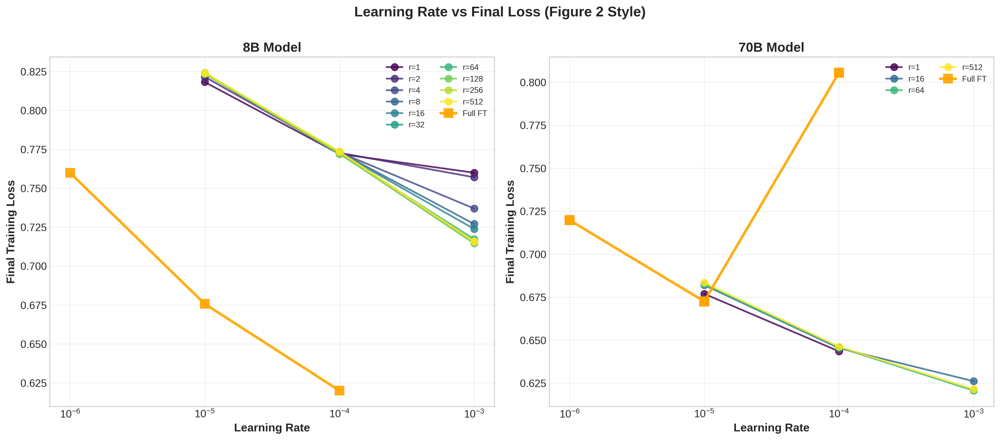
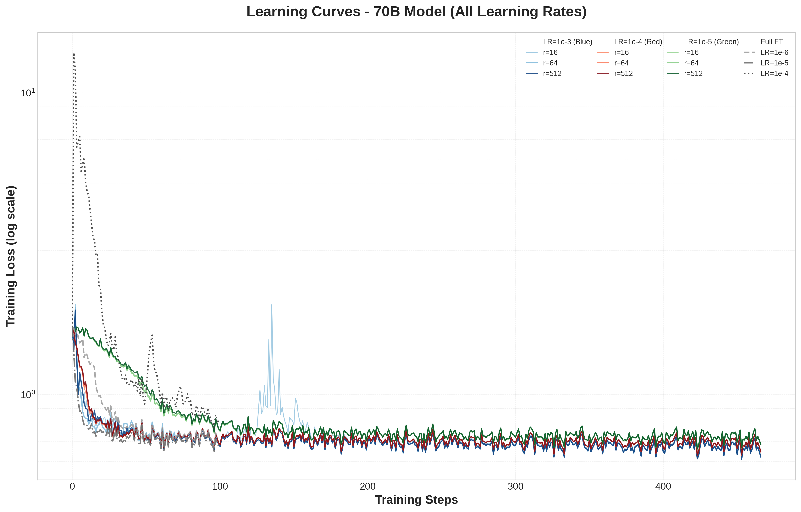

# LoRA Fine-Tuning Analysis: Swiss Legal Domain

Systematic validation of LoRA hyperparameter selection on domain-specific fine-tuning tasks.

## Abstract

We conduct a grid search over LoRA hyperparameters (learning rate, rank) on Apertus models (8B, 70B parameters) fine-tuned for Swiss legal judgment prediction. Our experiments reveal a trade-off between task-specific training loss and retention of general legal knowledge. Hyperparameters that minimize training loss on the task can severely degrade performance on a general legal knowledge benchmark (LEXam).

**Experimental Setup**: 52 training runs across 3 learning rates {1e-5, 1e-4, 1e-3} and 10 ranks {1, 2, 4, 8, 16, 32, 64, 128, 256, 512}, plus 6 full fine-tuning baselines. Task: Binary classification on Swiss Judgment Prediction dataset (85K training cases). Evaluation: Task accuracy and LEXam legal knowledge benchmark.

---

## 1. Learning Rate Observations


*Figure 1: Final training loss vs learning rate for LoRA and full fine-tuning.*

### Observations

Among the three learning rates tested {1e-5, 1e-4, 1e-3}:

**8B Model**: LoRA achieves lowest loss at LR=1e-3, full fine-tuning at LR=1e-4.

**70B Model**: LoRA achieves lowest loss at LR=1e-3, full fine-tuning at LR=1e-5. Full fine-tuning at LR=1e-4 exhibits training instability.

In both cases, the best-performing LoRA learning rate is higher than the best-performing full fine-tuning rate within our tested range.

---

## 2. Rank and Learning Rate Observations


*Figure 2: 8B training dynamics across ranks and learning rates.*


*Figure 3: 70B training dynamics. Rank=1 at LR=1e-3 diverges and is excluded from analysis.*

### Observations

For both model sizes, LR=1e-3 yields the lowest training loss across all tested ranks r ∈ {2, 4, 8, 16, 32, 64, 128, 256, 512}. Higher ranks (r≥32 for 8B, r≥64 for 70B) converge to nearly identical final loss values at this learning rate.

Within our limited learning rate sweep {1e-5, 1e-4, 1e-3}, the rank ordering by performance is consistent across learning rates, suggesting that hyperparameter search at a single representative rank may generalize to other ranks.

---

## 3. Task Performance vs Rank


*Figure 4: Swiss Judgment Prediction accuracy vs LoRA rank.*

### Observations

Task accuracy increases with rank at low ranks, then plateaus. Rank 64 achieves performance close to higher ranks while providing substantially more adaptation capacity than minimal ranks (r=1, 2, 4, 8).

---

## 4. Full Fine-Tuning vs LoRA

### Observations

For this task (Swiss legal domain, 85K training cases), full fine-tuning achieves lower training loss than LoRA even at the highest rank tested (r=512). LoRA updates a small fraction of model parameters while achieving competitive task performance.

---

## 5. Catastrophic Forgetting of Domain Knowledge


*Figure 5: 8B model - Training loss vs LEXam knowledge retention across learning rates and ranks. LR=1e-3 optimizes training loss but destroys general legal knowledge.*


*Figure 6: 70B model - Same catastrophic forgetting pattern. Higher learning rates induce complete knowledge collapse despite achieving lowest task loss.*

### Observations

**8B Model (LEXam Accuracy)**:
- LR=1e-5: Knowledge preserved (comparable to baseline)
- LR=1e-4: Partial degradation
- LR=1e-3: Catastrophic forgetting (despite best training loss)

**70B Model (LEXam Accuracy)**:
- LR=1e-5: Slight degradation
- LR=1e-4: Severe degradation
- LR=1e-3: Complete knowledge loss (despite best training loss)

### Observations

The learning rate that achieves lowest task-specific training loss (LR=1e-3) results in severe degradation of general legal knowledge as measured by LEXam. This pattern is consistent across model sizes and LoRA ranks.

The LEXam benchmark evaluates legal knowledge through multiple-choice questions, representing capabilities distinct from the binary classification training task. LR=1e-5 preserves LEXam performance while LR=1e-3 does not, despite achieving lower training loss.

---

## Recommendations

Based on 52 training runs across learning rates {1e-5, 1e-4, 1e-3} and ranks {1, 2, 4, 8, 16, 32, 64, 128, 256, 512}:

```yaml
learning_rate: 1e-5              # Preserves LEXam knowledge
lora_r: 64                       # Good task performance + capacity
lora_alpha: 32                   # Standard 2:1 ratio
lora_target_modules: all-linear  # Attention + MLP layers
batch_size: 16
num_train_epochs: 1              # ~500 steps sufficient
```

### Rationale

- **LR=1e-5**: Preserves LEXam performance while achieving reasonable task accuracy (unlike LR=1e-3 which achieves lower training loss but destroys LEXam performance)
- **Rank=64**: Achieves task performance close to higher ranks while providing more capacity than minimal ranks
- **All-linear modules**: Targets both attention and MLP layers

---

## Summary

### Key Observations

1. **Learning rates**: Among the three values tested {1e-5, 1e-4, 1e-3}, LoRA achieves lowest training loss at LR=1e-3 while full fine-tuning achieves lowest loss at LR=1e-4 (8B) or LR=1e-5 (70B).

2. **Rank consistency**: LR=1e-3 yields lowest training loss across all tested ranks for both model sizes.

3. **Training loss gap**: Full fine-tuning achieves lower training loss than LoRA (even at r=512) for this task.

4. **Knowledge retention trade-off**: LR=1e-3 achieves lowest training loss but severely degrades LEXam performance. LR=1e-5 preserves LEXam performance while achieving reasonable task accuracy.

5. **Practical choice**: LR=1e-5 with rank=64 preserves general knowledge while achieving competitive task performance.

### Limitations

This analysis is based on a limited learning rate sweep (3 values) and a single task domain (Swiss legal judgments). Broader conclusions about LoRA scaling properties would require more extensive hyperparameter exploration.

---

## Reproducibility

### Data

Training: Swiss Judgment Prediction (85K cases, binary classification)  
Evaluation: LEXam legal knowledge benchmark (multiple-choice questions)  
Models: Apertus-8B-Instruct, Apertus-70B-Instruct

### Code

```bash
# Fetch experimental data
cd report
export WANDB_API_KEY=<key>
python scripts/01_fetch_wandb_data.py

# Download training histories
python scripts/02_download_history.py

# Generate analysis plots
python scripts/03_generate_plots.py
```

### Repository Structure

```
peft_apertus/
├── configs/          # Training configurations (LoRA, Full FT, ZeRO)
├── lexam/            # LEXam evaluation scripts
└── report/           # Analysis pipeline
    ├── scripts/      # Data fetching and plot generation
    ├── analysis/     # Core utilities (data loading, plotting)
    ├── data/         # Training histories and evaluation results
    └── plots/        # Figures 1-6
```

