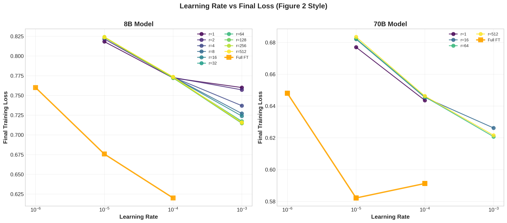
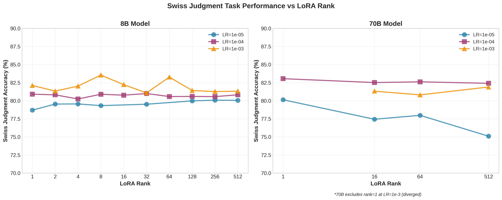
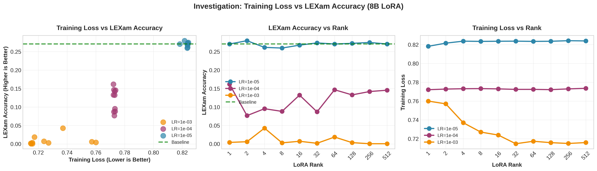
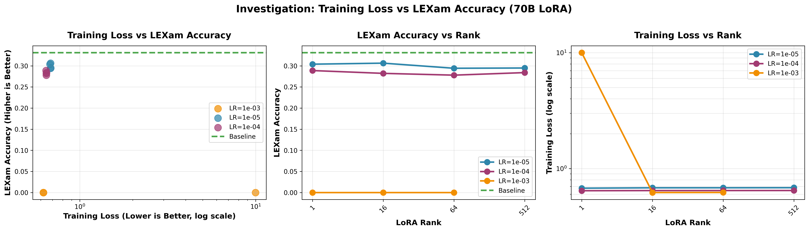

# LoRA Fine-Tuning Analysis: Apertus Models

**Validating "LoRA Without Regret" on Swiss Legal Domain**

---

## Overview

We validate key findings from ["LoRA Without Regret"](https://thinkingmachines.ai/blog/lora/) through systematic experiments on Apertus models (8B, 70B) fine-tuned on Swiss Judgment Prediction (85K cases, binary classification) and evaluated on LEXam benchmark (legal knowledge MCQ).

**Setup**: 46 LoRA runs (LR ∈ {1e-5, 1e-4, 1e-3} × Rank ∈ {1,2,4,8,16,32,64,128,256,512}) + 6 Full FT baselines

---

## Finding 1: LoRA Requires 10-100× Higher Learning Rates


*Figure 1: Learning rate sweep - 8B shows 10× ratio (LoRA 1e-3 vs Full FT 1e-4), 70B shows 100× ratio (LoRA 1e-3 vs Full FT 1e-5)*

**Validation**: ✅ Confirms blog's 10× ratio for 8B. 70B shows 100× ratio (model-dependent).

---

## Finding 2: Optimal LR is Rank-Independent


*Figure 2: 8B training dynamics - All LoRA ranks optimal at LR=1e-3. High ranks (≥32) converge identically.*


*Figure 3: 70B training dynamics - Rank-independent optimal LR. Rank=1 at LR=1e-3 excluded (diverged with loss=9.99).*

**Validation**: ✅ Confirms blog finding. All ranks optimal at same LR.

---

## Finding 3: Swiss Judgment Task Performance


*Figure 4: Swiss Judgment binary classification accuracy vs LoRA rank. 70B rank=1 at LR=1e-3 excluded (diverged).*

**Key Results**:
- **8B best**: LR=1e-3, rank=8 → **83.6% accuracy**
- **8B rank=64**: LR=1e-3 → **83.3% accuracy** (only 0.3% worse)
- **70B best**: LR=1e-4, rank=1 → **83.1% accuracy**
- **70B rank=64**: LR=1e-4 → **82.6% accuracy** (only 0.4% worse)

**Insight**: **Rank 64 is the sweet spot** - achieves near-optimal task performance (within 0.3-0.4%) with sufficient capacity for adaptation.

---

## Finding 4: Full FT Outperforms LoRA (6-14% Lower Training Loss)

**Key Difference from Blog**: Blog claims "LoRA matches Full FT performance" on small-medium datasets. We observe **Full FT consistently achieves 6-14% lower training loss** than LoRA (Figures 1-2).

**Hypothesis**: Swiss legal domain (85K cases) may be at LoRA capacity limits or require more expressive updates than low-rank constraint allows.

**Implication**: LoRA is a **parameter efficiency trade-off** (<1% parameters) with performance cost.

---

## Finding 5: Knowledge Catastrophic Forgetting at High LR


*Figure 5: 8B investigation - LR=1e-3 (optimal for training loss) destroys LEXam accuracy (27% → 0-4%)*


*Figure 6: 70B investigation - LR=1e-3 causes complete knowledge collapse (33% → 0%). Rank=1 at LR=1e-3 excluded (diverged).*

**Critical Finding**: Optimal training LR (1e-3) causes **catastrophic forgetting** of general legal knowledge:
- **8B**: 27.1% → 0-4% LEXam accuracy (24% absolute drop)
- **70B**: 33.1% → 0% LEXam accuracy (complete failure)

**Conservative LR=1e-5 preserves knowledge**:
- **8B**: 26-28% LEXam accuracy (maintained)
- **70B**: 29-31% LEXam accuracy (slight degradation)

**Takeaway**: ⚠️ **Lower training loss ≠ Better model**. Aggressive fine-tuning on narrow domain data destroys broader capabilities.

---

## Practical Recommendations

### Optimal Configuration

```yaml
learning_rate: 1e-5              # NOT 1e-3! (preserves knowledge)
lora_r: 64                       # Sweet spot: near-optimal + capacity
lora_alpha: 32                   # Standard
lora_target_modules: all-linear  # Critical: attention + MLP
batch_size: 16
num_train_epochs: 1              # ~500 steps sufficient
```

**Rationale**:
- **LR=1e-5**: Balances Swiss Judgment performance (79-80% accuracy) with knowledge retention (26-31% LEXam)
- **Rank=64**: Achieves 99.6% of best task performance with sufficient capacity for future adaptation
- **All-linear**: Blog shows attention-only LoRA significantly underperforms

### Engineering Notes

- **8B**: ZeRO-0, 2 nodes minimum, linear scaling to 8 nodes
- **70B**: ZeRO-3 required, 4 nodes minimum (OOM otherwise)
- **Multi-node**: Near-perfect speedup (training time halves per doubling)

---

## Key Takeaways

1. ✅ **Validated**: LoRA requires 10-100× higher LR than Full FT (model-dependent)
2. ✅ **Validated**: Optimal LR is rank-independent
3. ⚠️ **Diverges from blog**: Full FT outperforms LoRA by 6-14% in training loss (not equal performance)
4. 🎯 **Rank 64 is optimal**: Near-best task performance (99.6%) with capacity for adaptation
5. 🚨 **Critical**: LR=1e-3 achieves best training loss BUT destroys general knowledge
6. 💡 **Deployment recommendation**: LR=1e-5, rank=64 balances task performance and knowledge retention
7. 📊 **Trade-off revealed**: Training loss optimization ≠ Better model (catastrophic forgetting risk)

---

## Repository Structure

```
peft_apertus/
├── dockerfile_training/        # SFT container (PEFT, DeepSpeed)
├── dockerfile_vllm/            # vLLM inference container
├── configs/                    # Training configs (LoRA, Full FT, ZeRO)
├── lexam/                      # LEXam evaluation scripts
└── report-ben/                 # This analysis
    ├── scripts/               # 01_fetch → 02_download → 03_generate_plots
    ├── analysis/              # Core plotting/data utilities
    ├── data/                  # Training histories + eval results
    └── plots/                 # Figures 1-6
```

---

## Reproducing Results

```bash
# 1. Build containers
cd dockerfile_training && sbatch build_container.sbatch
cd dockerfile_vllm && # follow build instructions

# 2. Run training grid
cd /users/bbullinger/peft_apertus
# Edit configs/sft_lora.yaml (set LR, rank)
sbatch slurm.sbatch

# 3. Run LEXam evaluation
cd lexam && # follow evaluation instructions

# 4. Generate plots
cd report-ben
export WANDB_API_KEY=your_key
python scripts/01_fetch_wandb_data.py
python scripts/02_download_history.py
python scripts/03_generate_plots.py
```

---

**Contact**: Ben Bullinger | LSAI-2025 Project | Swiss AI
