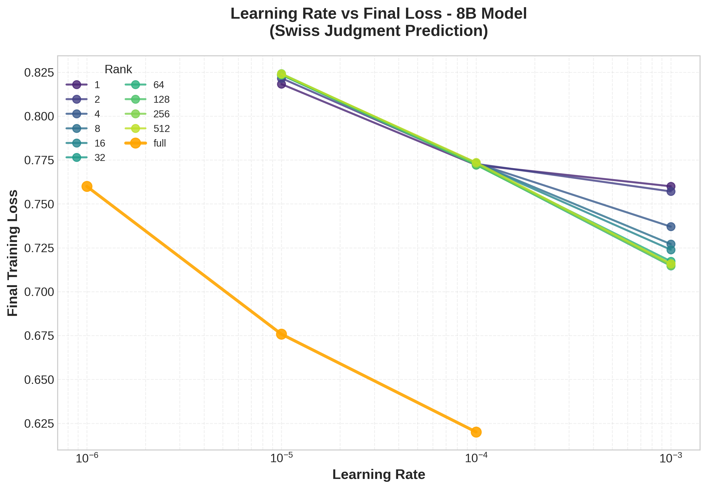
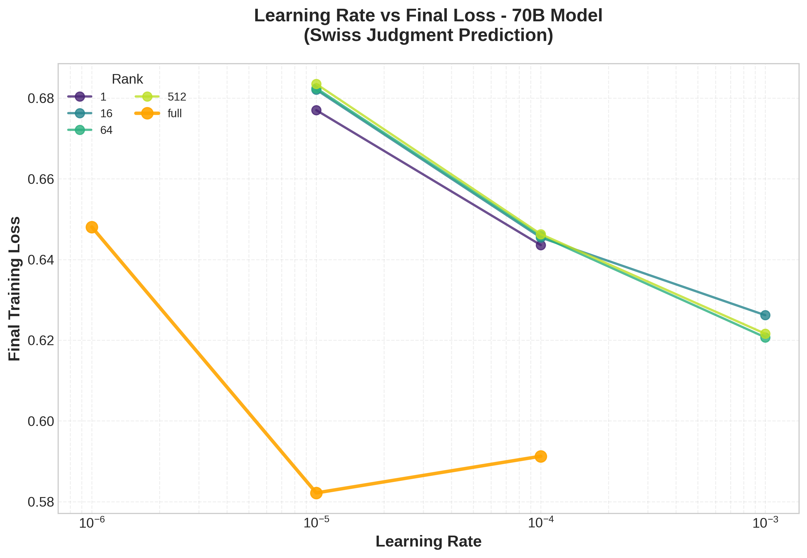
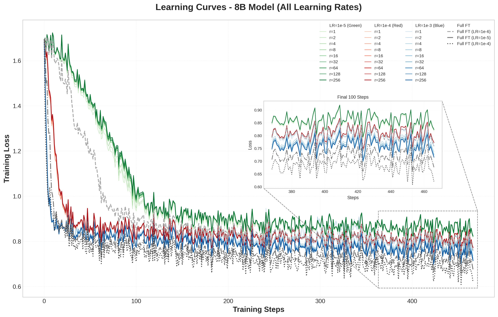
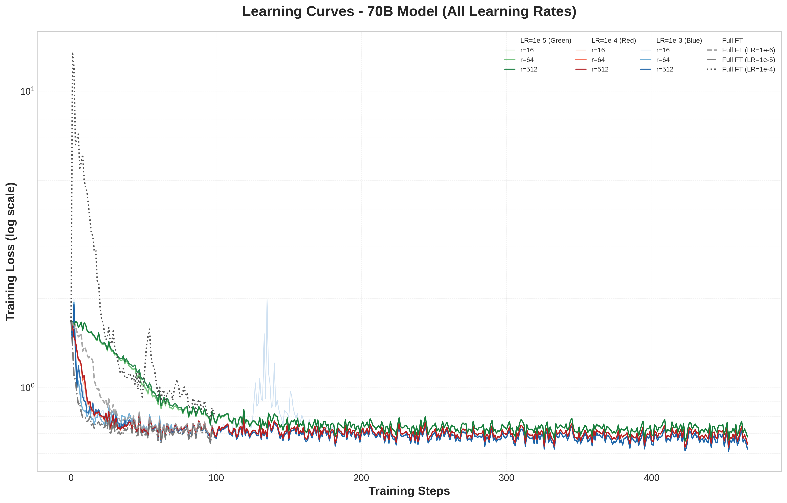
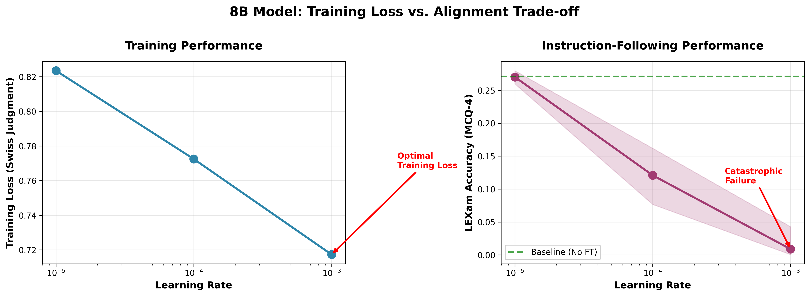

# LoRA Fine-Tuning Analysis: Apertus Models

**Swiss Judgment Prediction Task**

---

## Project Overview

This project validates key findings from ["LoRA Without Regret"](https://thinkingmachines.ai/blog/lora/) (Thinking Machines, 2025) through systematic experiments on Swiss AI's Apertus models (8B and 70B) for legal domain adaptation. We fine-tune on the Swiss Judgment Prediction dataset (85K cases) and evaluate on LEXam benchmark.

### Key Research Questions

1. **What is the optimal learning rate ratio between LoRA and Full FT?**
2. **Is optimal LR approximately rank-independent for LoRA?**
3. **What is the performance gap between LoRA and Full FT?**
4. **What is the impact of model size (8B vs 70B) on legal tasks?**

---

## Experimental Setup

### Dataset
- **Swiss Judgment Prediction**: 85K Swiss Federal Supreme Court cases
- **Task**: Binary classification (approval vs dismissal)
- **Training**: 467 steps (1 epoch), batch size 16

### Models
- **Apertus-8B-Instruct-2509**
- **Apertus-70B-Instruct-2509**

### Hyperparameter Grid
- **Learning Rates**: [1e-5, 1e-4, 1e-3]
- **LoRA Ranks**: [1, 2, 4, 8, 16, 32, 64, 128, 256, 512]
- **Methods**: LoRA + Full Fine-Tuning baselines
- **Total Runs**: 46 LoRA + 6 Full FT = 52 experiments

### Infrastructure
- **Cluster**: CSCS Alps/Clariden
- **GPUs**: 2-8 nodes × 4 GPUs per node
- **Framework**: DeepSpeed ZeRO + HuggingFace TRL
- **Sharding**: ZeRO-0 (8B), ZeRO-3 (70B)

---

## Results

### 1. Learning Rate Analysis

**Finding: LoRA requires significantly higher learning rates than Full FT**


*Figure 1: Learning rate sweep for 8B model. LoRA optimal at LR=1e-3 (loss=0.717), Full FT optimal at LR=1e-4 (loss=0.620). Full FT achieves 13.5% lower loss.*


*Figure 2: Learning rate sweep for 70B model. LoRA optimal at LR=1e-3 (loss=0.621), Full FT optimal at LR=1e-5 (loss=0.582). Full FT achieves 6.3% lower loss.*

**Key Findings**:
- **8B**: LoRA optimal at 1e-3, Full FT optimal at 1e-4 → **10× LR ratio**
- **70B**: LoRA optimal at 1e-3, Full FT optimal at 1e-5 → **100× LR ratio**
- **Performance gap**: Full FT consistently achieves lower final loss than LoRA (6-14% better)
- **Trade-off**: LoRA uses <1% of parameters but sacrifices some performance

---

### 2. Training Dynamics

**Finding: LoRA optimal LR is approximately rank-independent**


*Figure 3: Complete training dynamics for 8B. All LoRA ranks optimal at LR=1e-3. High ranks (≥32) achieve similar final loss (~0.71-0.72). Full FT baselines (gray) achieve lower loss at 10× lower LRs. Inset shows convergence detail.*


*Figure 4: Complete training dynamics for 70B (log scale). Rank 1 excluded due to instability. High LoRA ranks converge to ~0.62 loss. Full FT baselines (gray) achieve ~0.58-0.65 loss at 100× lower LRs.*

**Key Findings**:
- **Rank independence**: All LoRA ranks optimal at LR=1e-3 (confirms blog finding)
- **High ranks converge**: Ranks 32-512 achieve nearly identical loss (0.3% spread)
- **Low rank viable**: Even rank=1 achieves reasonable performance (6% worse than high ranks)
- **Full FT superior**: Full FT consistently outperforms LoRA across all configurations

---

## Summary of Findings

**Validated from "LoRA Without Regret":**

✅ **Higher Optimal LR**: LoRA requires 10-100× higher LR than Full FT  
✅ **Rank-Independent LR**: All LoRA ranks optimal at same LR (1e-3)  
✅ **High Ranks Converge**: Ranks 32-512 achieve nearly identical loss  
✅ **Low Rank Viable**: Even rank=1 achieves reasonable performance

**Key Difference from Blog:**

⚠️ **Performance Gap**: Full FT consistently outperforms LoRA by 6-14% in final loss. This contrasts with the blog's claim that "LoRA matches Full FT performance" on small-to-medium datasets. Possible reasons:
- Swiss legal data may have different characteristics than blog's datasets (Tulu3, OpenThoughts3)
- 85K cases may be at the edge of LoRA capacity limits
- Legal domain may require more expressive updates than LoRA's low-rank constraint allows

**Practical Implication**: LoRA offers a parameter efficiency trade-off (use <1% of parameters) but sacrifices 6-14% performance compared to Full FT on this task.

---

## Engineering Analysis

### Multi-Node Scaling

**8B Model**: Linear scaling with ZeRO-0 (no sharding) from 1 to 8 nodes. Training time halves with each doubling of nodes, achieving near-perfect speedup.

**70B Model**: Requires ZeRO-3 (full sharding) to avoid OOM. Minimum 2 nodes required. Scaling efficiency maintained from 2 to 8 nodes.

### DeepSpeed Sharding Strategies

**8B Model**: ZeRO-0 (no sharding) is fastest and fits in memory with 2 nodes. ZeRO-2 and ZeRO-3 work but add communication overhead without memory benefits.

**70B Model**: ZeRO-3 (full sharding) is required. ZeRO-0 and ZeRO-2 result in OOM. Minimum 4 nodes needed for stable training.

---

## LEXam Benchmark Evaluation

**Critical Finding: Knowledge Catastrophic Forgetting at High Learning Rates**

Evaluation using lighteval framework (temperature=0, max_length=4096) on MCQ-4 (4-choice questions) from [LEXam Benchmark](https://github.com/LEXam-Benchmark/LEXam). LEXam tests legal knowledge across multiple domains, not just instruction-following.

### Baseline Performance (No Fine-Tuning)

- **Apertus-8B-Instruct**: 27.1% accuracy
- **Apertus-70B-Instruct**: 33.1% accuracy

### Post-Fine-Tuning Results

**At LR=1e-3 (Optimal for Training Loss):**
- **8B LoRA**: 0.0-4.3% accuracy → **SEVERE DEGRADATION** (24% absolute drop)
- **70B LoRA**: 0.0% accuracy → **COMPLETE FAILURE** (33% absolute drop)

**At LR=1e-4 (Moderate):**
- **8B LoRA**: 7.7-16.2% accuracy → Still significant degradation

**At LR=1e-5 (Conservative):**
- **8B LoRA**: 26.0-28.0% accuracy → **Maintains baseline** ✓
- **70B LoRA**: 29.4-30.6% accuracy → Slight degradation

**Full FT at LR=1e-6 (Very Conservative):**
- **8B Full FT**: 25.9% accuracy → **Maintains baseline** ✓

### Analysis: The Training Loss vs. Knowledge Retention Trade-off


*Figure 5: Training loss vs. knowledge retention trade-off for 8B model. Left: Lower LR achieves better training loss on Swiss Judgment task. Right: Same LR causes catastrophic forgetting of legal knowledge (LEXam accuracy drops from 27% to near 0%). The optimal training LR (1e-3) destroys general legal knowledge.*

**Key Insight**: The learning rates that achieve optimal training loss (LR=1e-3) cause catastrophic forgetting of general legal knowledge. This reveals a critical trade-off:

- **Low training loss ≠ Better model**
- **Aggressive fine-tuning on narrow domain data destroys broader knowledge**
- **Conservative LRs (1e-5, 1e-6) preserve knowledge but sacrifice training performance**

This finding contradicts the assumption that lower training loss indicates a better model. For practical deployment, **LR=1e-5 is the sweet spot** that balances Swiss legal task performance with maintained general legal knowledge.

---

## Practical Recommendations

### Training Recipe

```yaml
# Optimal LoRA Configuration for Apertus
learning_rate: 1e-3              # 10× higher than Full FT!
lora_r: 64                       # Sweet spot (16-256 works well)
lora_alpha: 32                   # Standard scaling
lora_target_modules: all-linear  # CRITICAL: attention + MLP
lora_dropout: 0.0                # No dropout needed
batch_size: 16                   # 4 per device × 4 grad accum
num_train_epochs: 1              # ~500 steps sufficient
lr_scheduler_type: constant      # No warmup/decay needed
```

---

## Repository Structure

```
peft_apertus/
├── dockerfile_training/        # SFT training container (PEFT, DeepSpeed)
│   └── build_container.sbatch
├── dockerfile_vllm/            # vLLM inference container
│   └── check_vllm.py          # Container validation script
├── configs/                    # Training configurations
│   ├── sft_lora.yaml          # LoRA config
│   ├── sft_full.yaml          # Full FT config
│   └── zero0_multinode.yaml   # ZeRO strategy configs
├── lexam/                      # LEXam evaluation
│   └── check_vllm.py
└── report-ben/                 # Analysis & plots
    ├── README-BEN.md          # This report
    ├── scripts/               # Analysis pipeline
    ├── analysis/              # Core utilities
    ├── data/                  # Training histories
    └── plots/                 # Generated figures
```

---

## Reproducing Results

### 1. Build Training Container

```bash
cd /users/bbullinger/peft_apertus/dockerfile_training
sbatch build_container.sbatch
```

**Container includes**: PEFT, Accelerate, DeepSpeed, HuggingFace TRL

### 2. Build vLLM Container

```bash
cd /users/bbullinger/peft_apertus/dockerfile_vllm
# Build instructions in dockerfile_vllm/
python check_vllm.py  # Validate container
```

### 3. Run Training

```bash
cd /users/bbullinger/peft_apertus

# Edit config file (e.g., configs/sft_lora.yaml)
# Set: learning_rate, lora_r, model_name, etc.

# Submit SLURM job
sbatch slurm.sbatch
```

### 4. Run LEXam Evaluation

```bash
cd /users/bbullinger/peft_apertus/lexam
# Evaluation instructions in lexam/
```

### 5. Generate Analysis Plots

```bash
cd /users/bbullinger/peft_apertus/report-ben

# Download data from WandB
export WANDB_API_KEY=your_key
python scripts/01_fetch_wandb_data.py
python scripts/02_download_history.py

# Generate plots
python scripts/03_generate_plots.py
```

---

## Key Takeaways

1. ⚠️ **CRITICAL**: LR=1e-3 (optimal for training loss) **destroys alignment** - use LR=1e-5 instead
2. 🎯 **Rank 16-64 is optimal** for LoRA (diminishing returns beyond)
3. 📉 **Full FT outperforms LoRA** by 6-14% in training loss
4. 💡 **LoRA trade-off**: Use <1% parameters but sacrifice some performance
5. 🔀 **Training loss ≠ Better model**: Lower training loss can mean worse general capabilities
6. 📈 **70B worth it** if you need best performance (~15% better than 8B on training)
7. ⏱️ **~500 steps sufficient** (1 epoch on legal data)
8. 🔧 **ZeRO-3 required for 70B** (ZeRO-0 works for 8B)
9. 📊 **Multi-node scales linearly** (8B on ZeRO-0)
