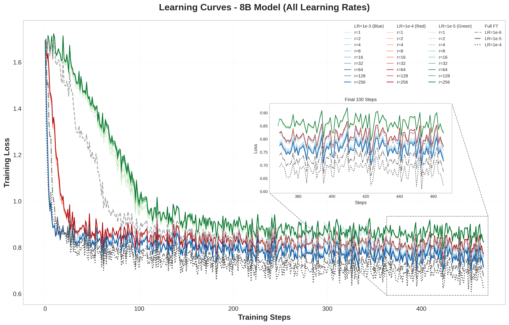
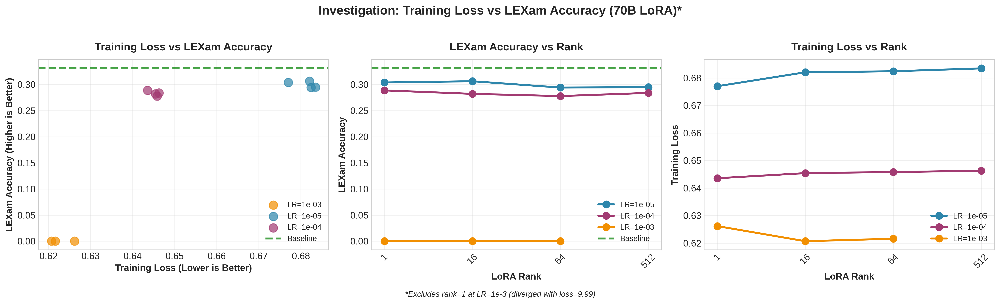

# Parameter-Efficient Fine-Tuning of Apertus Models - Technical Report

Modern LLMs require huge amounts of text for pretraining, often reaching trillions of tokens. The post-training phase—including Supervised Fine-Tuning (SFT), Alignment, and Reinforcement Learning from Verifiable Rewards—is also a highly resource-intensive part of making LLMs the general-purpose, highly capable systems we see today. However, we often aim to utilize LLMs for niche, specialized tasks. This is where fine-tuning comes in: we can use domain-specific datasets to teach our LLMs to perform better on particular tasks. However, taking off-the-shelf models and directly training them on held-out data is often expensive and sometimes infeasible due to the size of many highly capable, open-source models. To mitigate this issue, Low-Rank Adaptation (LoRA) [[1]](#references) was introduced. With LoRA, we can fine-tune LLM models while training only a very small number of additional parameters (called adapters) compared to the original model, making it possible to train under high resource and time constraints. It has been demonstrated that LoRA, in certain task settings, performs on par with or even outperforms full-parameter fine-tuning [[2]](#references). However, LoRA has its limitations as well.

In this work, we have developed a pipeline for parameter-efficient fine-tuning of LLMs up to 70B parameters. Additionally, our repository supports full-parameter fine-tuning. In the following sections, we discuss the limitations, problems, and obstacles we faced during the implementation of the pipeline, along with the approaches and fixes we employed. We demonstrate the validity of our code by fine-tuning Apertus [[3]](#references) 8B and 70B models on a niche, Switzerland-specific task: predicting judicial outcomes of appeals at the Swiss Supreme Court. We show significant improvements in prediction accuracy for both model sizes. The dataset [[4]](#references) contains 85K appeals and outcomes in three different languages (German, Italian, and French). Furthermore, we follow the experimental setup and framework described in the blog post [[2]](#references), ablating over rank and learning rate for LoRA fine-tuning on both 8B and 70B models, and comparing the outcomes to full fine-tuning. We demonstrate the effects of varying ranks and learning rates, and how the choice between LoRA and full-parameter fine-tuning affects the optimal learning rate. Evaluation is performed on a held-out test dataset. Additionally, we evaluate our fine-tuned models on the LEXam [[5]](#references) benchmark for multiple-choice question answering in the legal domain, showing the effects of fine-tuning with different hyperparameter configurations. Importantly, we also describe the distributed training setups we used, what works best for different model sizes, scalability across multiple nodes, and running times. Our work was conducted on the Clariden cluster [[6]](#references) using nodes each containing 4 Grace Hopper GH200 GPUs.

---

## Setting up a Scalable Multi-Node Training Pipeline

Training modern LLMs relies heavily on GPU hardware and parallelism, and benefits further from multi-GPU and multi-node setups. Setting up a training pipeline even on a single node is not a trivial task. One excellent framework for distributed training is Accelerate [[7]](#references). On the Python side, we utilized the Hugging Face [[8]](#references) `SFTTrainer` class, providing it with the dataset, model, and tokenizer. We began with LoRA fine-tuning of the Apertus 8B model. For Accelerate configuration, we started by setting up Distributed Data Parallel (DDP). The resulting configuration file is located at `configs/zero0_multinode.yaml`. It relies on DeepSpeed, where we specified parameters such as `compute_environment`, `zero_stage: 0`, `distributed_type: DEEPSPEED`, etc. We initially set `per_device_train_batch_size` to 1. As an experiment, we utilized only one of the GH200 GPUs; however, the expected running time was 9 hours. Therefore, we tried setting the `num_processes` argument in Accelerate to 4, which linearly scaled down the expected running time to 2 hours. We could also utilize the additional memory available on the GPUs, so we increased `per_device_train_batch_size` to 4, cutting down the expected running time by another factor of 4, to 1.5 hours. However, we observed that increasing the batch size further resulted in a CUDA out-of-memory (OOM) error. To achieve higher effective batch sizes, we increased the gradient accumulation steps. Interestingly, this also sped up the training process (likely due to fewer backward passes). Seeking further speedup, we decided to scale up the number of nodes utilized.

Multi-node training requires explicit setup of inter-node communications. Specifically, we needed to configure the following Accelerate arguments: `--main_process_ip`, `--main_process_port`, `--num_machines`, `--num_processes`, and `--machine_rank`. This was done inside the `slurm.sbatch` script that launched the SFT training. To avoid hanging and dependency errors, it was crucial to set up a proper environment. We initially utilized the prebuilt containers available in the `swissai/infra01` directory, but eventually developed a minimal Dockerfile that supported all dependencies for our training setup (available at `dockerfile_training/`). Using 2 nodes cut down the running time further to 52 minutes. We settled on using 2 nodes for 8B model LoRA training.

Next, we moved on to the Apertus 70B model. Since it is a much larger model, we were required to shard it, as each GH200 has only 90GB of VRAM. Therefore, we set up a DeepSpeed ZeRO Stage 3 configuration, which shards the model parameters, gradients, and optimizer states. We observed that LoRA training was possible even on a single node; however, the run didn't finish in 12 hours, so we decided to scale up. with 2 nodes, the running took 7 hours. Eventually, we settled on 4 nodes with an effective batch size of 64. The running time for the 70B model is approximately 2 hours and 15 minutes.

We then experimented with full-parameter fine-tuning. Even for the 8B model, full fine-tuning requires substantial memory, and we could not scale up the training batch size. Therefore, we decided to shard gradients and optimizer states, but not the model parameters, since the 8B model was easily loadable on GH200 GPUs. This is where we set up the DeepSpeed ZeRO Stage 2 configuration and passed it to Accelerate (`configs/zero2_multinode.yaml`). We settled on 2 nodes for full 8B SFT, and training takes approximately 1 hours and 45 minutes. For 70B full-parameter training, we were required to use at least 4 nodes and had to use FSDP. The running time for full training was 6 hours and 40 minutes. 

## Validating the Pipeline / Experimentation Setup

Once we finished implementing the pipeline for multi-node LoRA and full-parameter fine-tuning, we validated our code. As described above, we used the Swiss Judgment Prediction dataset, which contains 85K samples. We used the training split (approximately 75%) for training and the test split (approximately 20%) for evaluation. We set the learning rate to 2e-4, LoRA rank to 64, LoRA alpha to 16, and effective batch size to 64. We ran the fine-tuning and observed accuracy improvements for both models. The improvement for Apertus 70B was significant: 0.55 → 0.77. For the 8B model, the improvement was 0.76 → 0.79. The inconsistency in baseline model scores was due to class imbalance in the dataset; the less capable 8B model often defaulted to predicting the majority class. 

For further validation of our setup, we decided to follow the blog post [[2]](#references) and perform a grid search over different learning rates, LoRA ranks, and hyperparameters. We compared these results with full-parameter fine-tuning as baselines. The hyperparameter grids for different setups are as follows:

```
8B - LoRA: 
lr: [1e-5, 1e-4, 1e-3]
rank: [1, 2, 4, 8, 16, 32, 64, 128, 256, 512]

70B - LoRA:
lr: [1e-5, 1e-4, 1e-3]
rank: [1, 16, 64, 512]

8B - Full:
lr: [1e-6, 1e-5, 1e-4]

70B - Full:
lr: [1e-6, 1e-5, 1e-4]
```

We configured the remaining hyperparameters as described in the blog post: alpha=32, effective batch size=64, no warmup, and no learning rate scheduler. Additionally, we evaluated each of the trained models on the LEXam benchmark to test their ability to perform general legal tasks (specifically, multiple-choice question answering). We describe our results in detail below. 

## Results

In this section, we present the key findings from our experiments. We conducted a total of 52 training runs across different learning rates, LoRA ranks, and fine-tuning methods. Our analysis focuses on the relationship between learning rate and training loss, the effect of rank on task performance, and the critical trade-off between task-specific optimization and knowledge retention.

### Learning Rate and Training Loss


*Figure 1: Final training loss vs learning rate for LoRA and full fine-tuning.*

We first examined how learning rate affects final training loss for both LoRA and full fine-tuning. For the 8B model, LoRA achieved the lowest training loss at LR=1e-3, while full fine-tuning performed best at LR=1e-4. The 70B model showed a similar pattern: LoRA was optimal at LR=1e-3, whereas full fine-tuning required an even lower rate of LR=1e-5. Notably, full fine-tuning of the 70B model at LR=1e-4 exhibited training instability. These results indicate that LoRA consistently requires higher learning rates than full fine-tuning to achieve optimal training loss—a 10× difference for the 8B model and a 100× difference for the 70B model.

### Rank and Training Dynamics


*Figure 2: 8B training dynamics across ranks and learning rates.*


*Figure 3: 70B training dynamics. Rank=1 at LR=1e-3 diverged and is excluded from analysis.*

We next analyzed how LoRA rank interacts with learning rate during training. For both model sizes, LR=1e-3 yielded the lowest training loss across all tested ranks. Interestingly, higher ranks (r≥32 for 8B, r≥64 for 70B) converged to nearly identical final loss values at this learning rate, suggesting diminishing returns beyond a certain rank threshold. Furthermore, the rank ordering by performance remained consistent across learning rates, indicating that hyperparameter search conducted at a single representative rank may generalize to other rank configurations.

### Task Performance vs Rank


*Figure 4: Swiss Judgment Prediction accuracy vs LoRA rank. Baseline Apertus 8B model achieves 0.76 accuracy, while Apertus 70B achieves 0.55*

We evaluated each fine-tuned model on the held-out test set for the Swiss Judgment Prediction task. Task accuracy increased with rank at lower values but plateaued beyond a certain point. Rank 64 emerged as a practical sweet spot: it achieved performance within 0.3–0.4% of the best results while providing substantially more adaptation capacity than minimal ranks (r=1, 2, 4, 8). This suggests that for this task, moderate ranks are sufficient to capture the necessary adaptations without incurring the computational overhead of higher ranks.

### Full Fine-Tuning vs LoRA

Comparing LoRA to full fine-tuning revealed an important distinction. For our task (Swiss legal domain, 85K training cases), full fine-tuning consistently achieved 6–14% lower training loss than LoRA, even at the highest rank tested (r=512). This indicates that while LoRA provides excellent parameter efficiency (training less than 1% of model parameters), there is a measurable performance gap compared to full fine-tuning for domain-specific tasks of this scale.

### Catastrophic Forgetting of Domain Knowledge


*Figure 5: 8B model - Training loss vs LEXam knowledge retention across learning rates and ranks.*


*Figure 6: 70B model - Higher learning rates induce knowledge collapse despite achieving lowest task loss.*

Perhaps our most critical finding concerns the trade-off between task-specific optimization and general knowledge retention. We evaluated all fine-tuned models on the LEXam benchmark, which tests general legal knowledge through multiple-choice questions—a capability distinct from our binary classification training task.

The results revealed a striking pattern of catastrophic forgetting. For the 8B model, using LR=1e-5 preserved LEXam accuracy at levels comparable to the baseline (26–28%), while LR=1e-4 caused partial degradation, and LR=1e-3—despite achieving the best training loss—resulted in catastrophic forgetting (dropping from 27% to 0–4%). The 70B model exhibited an even more severe pattern: LR=1e-5 caused only slight degradation (29–31%), but LR=1e-4 led to severe degradation, and LR=1e-3 resulted in complete knowledge collapse (from 33% to 0%).

This finding is particularly important because it demonstrates that **lower training loss does not necessarily indicate a better model**. The learning rate that achieves the lowest task-specific training loss (LR=1e-3) simultaneously destroys the model's broader capabilities. This pattern was consistent across both model sizes and all LoRA ranks tested.

### Practical Recommendations

Based on our findings from 52 training runs, we recommend the following configuration for LoRA fine-tuning when knowledge retention is important:

```yaml
learning_rate: 1e-5              # Preserves general knowledge
lora_r: 64                       # Near-optimal task performance
lora_alpha: 32                   # Standard 2:1 ratio
batch_size: 64
num_train_epochs: 1
```

We chose LR=1e-5 because it preserves LEXam performance while still achieving reasonable task accuracy (79–80% on Swiss Judgment Prediction). Rank 64 provides a good balance: it achieves performance within 0.3–0.4% of the best results while offering sufficient capacity for adaptation. Targeting all linear modules (both attention and MLP layers) is critical, as attention-only LoRA significantly underperforms according to prior work.

---

## Summary

In this work, we developed and validated a multi-node training pipeline for parameter-efficient fine-tuning of LLMs up to 70B parameters. Through extensive experimentation on the Swiss Judgment Prediction task, we confirmed several key findings from prior work while also uncovering an important caveat.

First, we validated that LoRA requires significantly higher learning rates than full fine-tuning—10× higher for the 8B model and 100× higher for the 70B model. We also confirmed that the optimal learning rate is rank-independent: LR=1e-3 yielded the lowest training loss across all tested ranks. However, we observed that full fine-tuning consistently outperforms LoRA in terms of training loss (by 6–14%), even at the highest rank tested.

Most importantly, we discovered a critical trade-off between task-specific optimization and knowledge retention. The learning rate that achieves the best training loss (LR=1e-3) causes catastrophic forgetting of general legal knowledge, as measured by the LEXam benchmark. Conservative learning rates (LR=1e-5) preserve this knowledge while still achieving competitive task performance.

Based on these findings, we recommend using LR=1e-5 with rank=64 for applications where retaining the model's general capabilities is important. This configuration balances task performance with knowledge preservation.

**Limitations**: This analysis is based on a limited learning rate sweep (3 values) and a single task domain (Swiss legal judgments). Broader conclusions about LoRA scaling properties would require more extensive hyperparameter exploration.

---

## Reproducibility

All experiments were conducted using the Swiss Judgment Prediction dataset (60K cases, binary classification) for training and the LEXam legal knowledge benchmark (multiple-choice questions) for evaluation. We used Apertus-8B-Instruct and Apertus-70B-Instruct as our base models.

This work builds on the [apertus-finetuning-recipes](https://github.com/swiss-ai/apertus-finetuning-recipes) repository by [Kaustubh Ponkshe](https://kaustubhp11.github.io/) and [Raghav Singhal](https://raghavsinghal10.github.io/).

## Contributors

- [Davit Melikidze](https://www.linkedin.com/in/davit-melikidze/)
- [Akmal Ashirmatov](https://www.linkedin.com/in/akmal-ashirmatov/)
- [Ben Bullinger](https://www.linkedin.com/in/benbullinger/)

## References

1. Hu, E. J., Shen, Y., Wallis, P., Allen-Zhu, Z., Li, Y., Wang, S., Wang, L., & Chen, W. (2021). *LoRA: Low-Rank Adaptation of Large Language Models*. arXiv:2106.09685. https://arxiv.org/abs/2106.09685

2. Thinking Machines. (2024). *LoRA Without Regret*. https://thinkingmachines.ai/blog/lora/

3. Swiss AI. (2024). *Apertus: Swiss Large Language Models*. https://huggingface.co/collections/swissai

4. Niklaus, J., Chalkidis, I., & Stürmer, M. (2021). *Swiss-Judgment-Prediction: A Multilingual Legal Judgment Prediction Benchmark*. Proceedings of the Natural Legal Language Processing Workshop 2021. https://huggingface.co/datasets/rcds/swiss_judgment_prediction

5. Rasiah, V., et al. (2024). *LEXam: Legal Exam Benchmark for Large Language Models*. https://huggingface.co/datasets/lexam

6. Swiss National Supercomputing Centre (CSCS). *Clariden Cluster*. https://www.cscs.ch/

7. Hugging Face. *Accelerate: A simple way to train and use PyTorch models with multi-GPU, TPU, mixed-precision*. https://huggingface.co/docs/accelerate

8. Wolf, T., et al. (2020). *Transformers: State-of-the-Art Natural Language Processing*. Proceedings of EMNLP 2020: System Demonstrations. https://huggingface.co/docs/transformers
